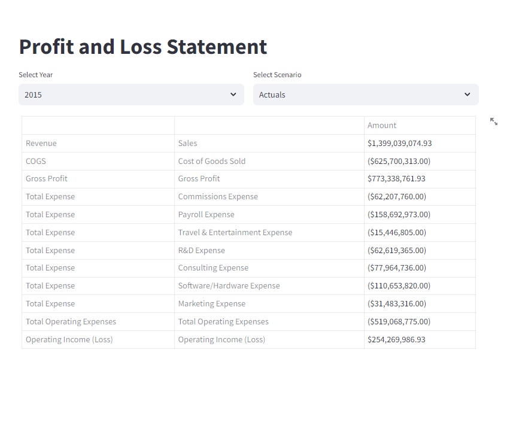

# Financial Dashboard Project
Dashboard using Python Streamlit for financial Data 

## Overview

This Financial Dashboard project is designed to provide a user-friendly interface for analyzing and visualizing financial data. The dashboard is built using Streamlit, a Python library for creating web applications with minimal effort. It allows users to interactively explore key financial metrics and gain insights into various aspects of financial performance.





## Features

- **Interactive Visualizations:** Engage with dynamic charts and graphs to visualize financial data trends.
- **Data Exploration:** Select specific years, scenarios, and other parameters to explore data subsets.
- **Profit and Loss (P&L) Statement:** View and analyze the P&L statement with multi-level hierarchy.
- **Styling and Formatting:** Apply styles to highlight important financial metrics and improve readability.

## Prerequisites

Make sure you have the following prerequisites installed:

- Python (>=3.6)
- Streamlit library
- Pandas library
- Other necessary dependencies (install using `pip install -r requirements.txt`)

## Getting Started

1. Clone the repository:

    ```bash
    git clone https://github.com/Mohshaikh23/Streamlit-Dashboard-Project
    cd financial-dashboard
    ```

2. Install dependencies:

    ```bash
    pip install -r requirements.txt
    ```

3. Run the Streamlit app:

    ```bash
    streamlit run app.py
    ```

4. Access the dashboard in your web browser at [http://localhost:8501](http://localhost:8501).

## Usage

- Choose the desired year and scenario from the provided dropdowns.
- Explore different financial metrics and visualizations.
- Interact with the dynamic elements to customize your analysis.

## Project Structure

- **`app.py`:** Main application script containing the Streamlit app logic.
- **`data/`:** Folder containing sample financial data or data sources.
- **`multipage_app/`:** Module for organizing the Streamlit app into multiple pages.
- **`pages/`:** Individual page scripts for specific sections of the dashboard.
- **`Pipeline/`:** Module containing data processing and analysis scripts.

## Contributing

If you would like to contribute to this project or report issues, please follow the standard GitHub procedures for pull requests and issue reporting.

## License

This project is licensed under the MIT License - see the [LICENSE](LICENSE) file for details.

## Acknowledgments

- The dashboard is built using Streamlit and other open-source libraries.
- Special thanks to [contributors](https://github.com/yourusername/financial-dashboard/graphs/contributors) who have participated in this project.

